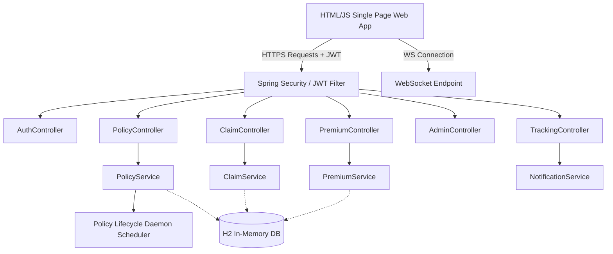

# On-Demand Micro Insurance Platform (OD-MIP)

An innovative, transactional, and dynamic micro-insurance platform designed for granular, short-term coverage (per-minute, per-hour, or per-day). It supports gadgets, travel, and rental vehicle coverages with real-time tracking, dynamic risk-based pricing, and an automated policy lifecycle management daemon.

---

## 🚀 Key Features

*   **Granular Coverages:** Purchase on-demand insurance templates with durations measured in minutes, hours, or days.
*   **Dynamic Premium Engine:** Pricing is calculated dynamically based on time units, user risk profile multipliers, and discount coupon codes.
*   **Real-time Lifecycle Daemon:** An active background scheduler runs every 10 seconds to:
    *   Activate pending policies that have reached their scheduled start time.
    *   Expire active policies that have surpassed their duration limits.
    *   Track simulated usage and utilization metrics.
*   **Real-Time Notifications:** Alerts for policy activation, policy expiration, and high-risk claim flags are broadcasted in real time via WebSockets and stored persistently.
*   **Claims Workflow & Fraud Detection:** Users can submit claims for active/expired policies. Claims undergo fraud screening based on user risk score thresholds (flagging scores $\ge 75\%$).
*   **Role-Based Security:** Fully secured REST endpoints utilizing Spring Security and JSON Web Tokens (JWT).
*   **Interactive SPA UI:** An embedded Single Page Application (SPA) dashboard to manage claims, view active metrics, purchase policies, and view notifications.
*   **Self-Seeding Database:** Automatically pre-populates default accounts, policy templates, and discount coupons upon application startup.

---

## 🛠️ Technology Stack

*   **Backend Framework:** Spring Boot 3.3.5 (Java 21)
*   **Security:** Spring Security & JSON Web Tokens (JJWT)
*   **Persistence & Database:** Spring Data JPA with H2 (in-memory database)
*   **Real-Time Services:** Spring Boot WebSocket
*   **API Documentation:** OpenAPI 3 / Swagger UI via Springdoc
*   **Lombok:** Clean boilerplate reduction
*   **Frontend:** Vanilla HTML5 / TailwindCSS (via CDN) / JS Single Page Application (`src/main/resources/static/index.html`)

---

## 📂 Project Architecture



---

## ⚙️ Configuration & Ports

Configurations are housed under [application.properties](file:///c:/Users/gnana/IdeaProjects/MicroInsurancePlatform/src/main/resources/application.properties):

*   **Server Port:** `8080` (default)
*   **H2 Database Console:** Enabled at `/h2-console`
    *   *JDBC URL:* `jdbc:h2:mem:odmipdb`
    *   *Username:* `gnana`
    *   *Password:* `gnana@14`
*   **JWT Key Secret:** Configured via `app.jwt.secret` (256-bit Hex)
*   **WebSocket Topic:** `/topic/notifications`

---

## 👥 Seeded Accounts

The application is pre-seeded via [DataSeeder.java](file:///c:/Users/gnana/IdeaProjects/MicroInsurancePlatform/src/main/java/com/example/microinsuranceplatform/config/DataSeeder.java) with the following accounts (Password format is `username123`):

| Username | Role | Initial Risk Score | Description / Use Case |
| :--- | :--- | :--- | :--- |
| `admin` | `ADMIN` | `10.0` | Full administrative controls and template/coupon creation |
| `underwriter` | `UNDERWRITER` | `10.0` | Reviews, approves, or rejects submitted claims |
| `user` | `USER` | `10.0` | Normal user, low-risk calculations |
| `riskuser` | `USER` | `75.0` | High-risk profile for testing fraud dynamic pricing flags |

### Active Coupons Seeded
*   `WELCOME50` - 50% discount
*   `TRAVEL20` - 20% discount
*   `GADGET15` - 15% discount

---

## 🔌 API Endpoints Reference

### 🔐 Authentication (`/api/auth`)
*   `POST /api/auth/register` - Create a new user account.
*   `POST /api/auth/login` - Authenticate credentials and receive a JWT.
*   `GET /api/auth/profile` - Retrieve current logged-in user profile attributes.

### 📋 Policies (`/api/policies`)
*   `GET /api/policies/templates` - Retrieve all available insurance coverage templates.
*   `POST /api/policies/purchase` - Purchase a micro-policy cover.
*   `GET /api/policies/my-policies` - Fetch all policies purchased by the current user.

### 💰 Premium Calculation (`/api/premium`)
*   `GET /api/premium/calculate` - Estimate premiums dynamically before purchasing.
*   `GET /api/premium/coupon/validate` - Validate coupon validity and percentage.

### 🚨 Claims (`/api/claims`)
*   `POST /api/claims/submit` - File a claim against an active or expired policy.
*   `GET /api/claims/my-claims` - Fetch all submitted claims for the logged-in user.

### 📈 Real-Time & Tracking (`/api/tracking`)
*   `GET /api/tracking/policy/{policyId}` - Retrieve live utilization levels and usage logs.
*   `GET /api/tracking/notifications` - Retrieve list of notifications.
*   `POST /api/tracking/notifications/read-all` - Mark notifications as read.

### 👑 Administration & Underwriting (`/api/admin`) (Admin/Underwriter roles)
*   `GET /api/admin/dashboard` - Global platform performance dashboard metrics (revenue, active policies, average risk score).
*   `GET /api/admin/claims` - View all submitted claims across the platform.
*   `POST /api/admin/claims/{claimId}/review` - Approve or reject claims with custom comments.
*   `GET /api/admin/coupons` - View all coupons.
*   `POST /api/admin/coupons` - Create new coupon rules.
*   `POST /api/admin/templates` - Create new insurance policy templates.

---

## 🏃 Getting Started & Local Run

### Prerequisites
*   Java Development Kit (JDK) 21
*   Maven 3+ (or use the packaged wrapper `./mvnw`)

### Build the Application
```bash
# Clean and compile packages
./mvnw clean package -DskipTests
```

### Run the Application
```bash
# Boot the application
./mvnw spring-boot:run
```

Once up and running, access:
*   **Web Portal Dashboard:** [http://localhost:8080](http://localhost:8080)
*   **H2 Database Console:** [http://localhost:8080/h2-console](http://localhost:8080/h2-console)
*   **Interactive Swagger UI:** [http://localhost:8080/swagger-ui/index.html](http://localhost:8080/swagger-ui/index.html)
